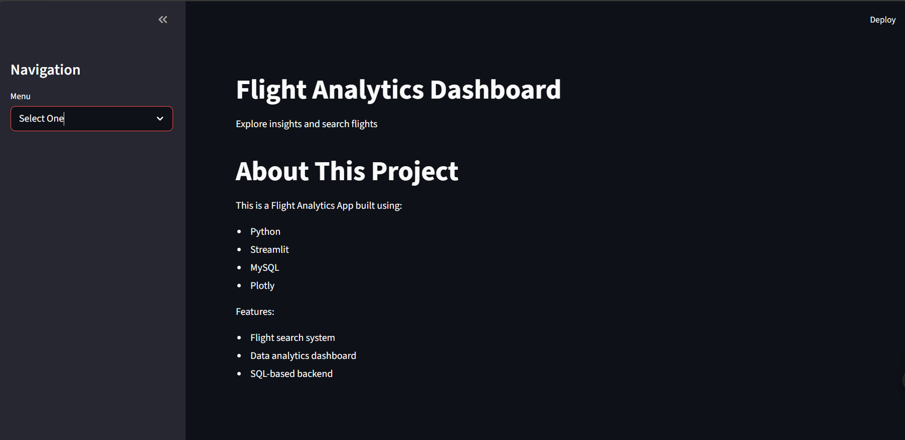
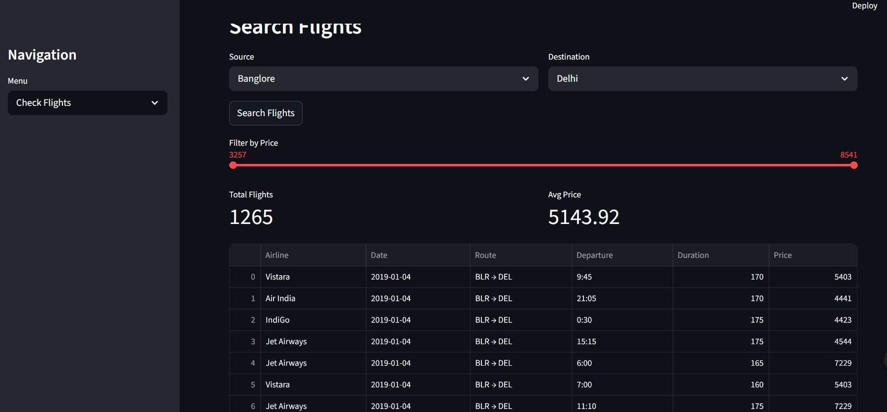
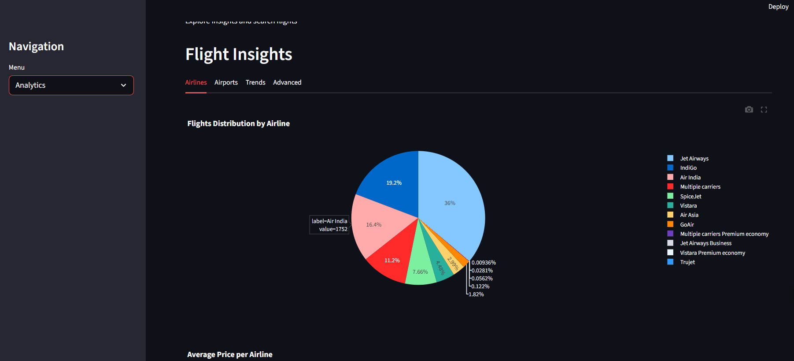
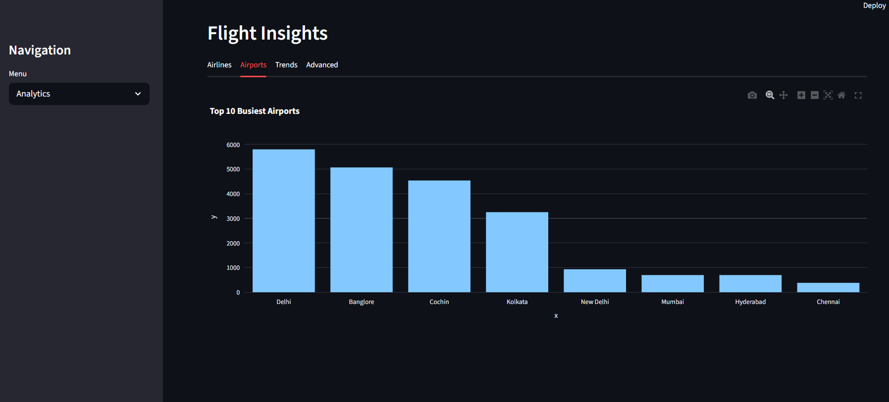
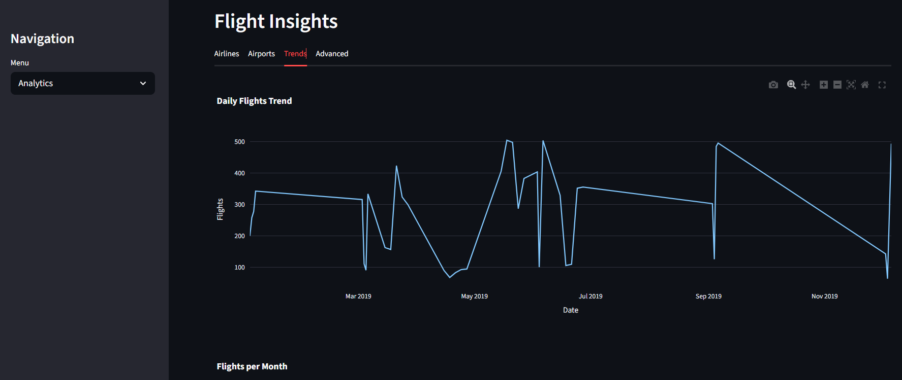
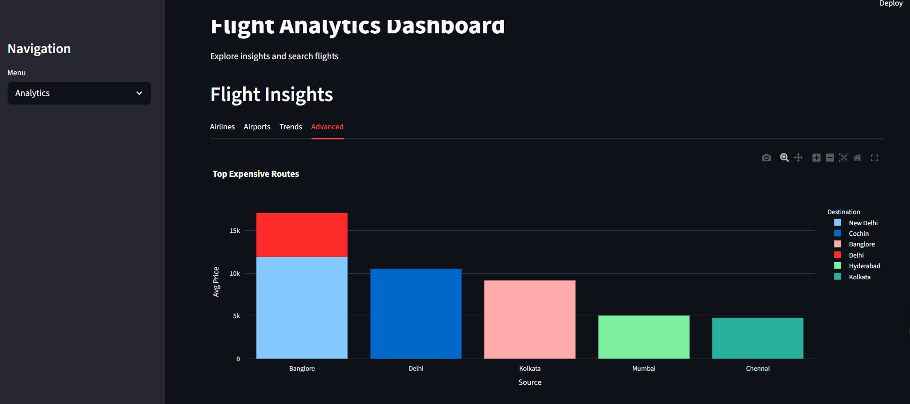

# ✈️ Flight Analytics Dashboard

An interactive data analytics web application built using **Streamlit**, **Python**, and **MySQL (Railway Cloud DB)**.
This app allows users to explore flight data, search routes, and visualize insights through interactive charts.

---

## 🚀 Features

- 🔍 **Search Flights**
  - Select source and destination
  - View available flights with details

- 📊 **Analytics Dashboard**
  - Flights distribution by airline
  - Top 10 busiest airports
  - Daily flight trends
  - Monthly flight trends
  - Average price per airline
  - Most expensive routes

- 🎯 **Interactive UI**
  - Filters (price range)
  - Metrics (total flights, avg price)
  - Tabs for better navigation

---

## 🛠️ Tech Stack

- **Frontend**: Streamlit
- **Backend**: Python
- **Database**: MySQL (Railway Cloud)
- **Visualization**: Plotly
- **Data Handling**: Pandas

---

## 🧠 Project Architecture

```
Streamlit UI
   ↓
Python (DB Class)
   ↓
MySQL Database (Railway Cloud)
```

---

## 🔐 Security Features

- Environment variables used for database credentials
- Secrets managed securely using Streamlit Secrets
- SQL Injection prevented using parameterized queries

---

## 📂 Project Structure

```
flight-analytics-app/
│
├── app.py
├── dbhelper.py
├── requirements.txt
├── .gitignore
└── README.md
```

---

## ⚙️ Setup Instructions (Local)

1. Clone the repository:

```
git clone https://github.com/your-username/flight-analytics-app.git
cd flight-analytics-app
```

2. Create virtual environment:

```
python -m venv venv
source venv/bin/activate   # (Windows: venv\Scripts\activate)
```

3. Install dependencies:

```
pip install -r requirements.txt
```

4. Create `.env` file:

```
DB_HOST=your_host
DB_USER=your_user
DB_PASSWORD=your_password
DB_PORT=your_port
DB_NAME=your_db
```

5. Run the app:

```
streamlit run app.py
```

---

## ☁️ Deployment

This app is deployed using **Streamlit Cloud**.

- Secrets are configured in Streamlit Cloud settings
- Database is hosted on Railway

---

## 📸 Screenshots









---

## 💡 Key Learnings

- Building end-to-end data applications
- Connecting Python with cloud databases
- Writing modular and reusable database code
- Creating interactive dashboards
- Handling real-world messy datasets

---

## 🚀 Future Improvements

- Add flight price prediction (ML model)
- Improve dataset quality
- Add user authentication
- Enhance UI/UX

---

## 🙌 Acknowledgements

Dataset sourced from public datasets (e.g., Kaggle)

---

## 📬 Contact

Feel free to connect and give feedback!

---
